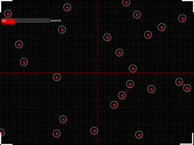
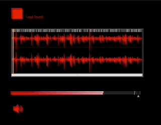

# Mubu_Generative_Sound_Control_Interface
Mubu Generative Sound Control Interface is a processing graphical interface to control a MaxMSP audio patch. It connects via OSC from [Processing](https://processing.org/) to [Max MSP](https://cycling74.com/products/max). 

[MuBu](https://ircam-ismm.github.io/max-msp/mubu.html#real-time-processing-of-audio-and-sensor-data) is a toolbox for Multimodal Analysis of Sound and Motion, Interactive Sound Synthesis and Machine Learning. 

MuBu handles: 

* Interactive Machine Learning
  * KNN (k-nearest neighbours search)
  * PCA (principal component analysis)
  * GMM (Gaussian mixture model recognition), GMR (regression)
  * HMM (hidden Markov model recognition), XMM (regression);
  * DTW (dynamic time warping)
  * Gesture following (GF) and Gesture Variation Following
* Interactive Sound Synthesis
  * Granular synthesis
  * Concatenative synthesis
  * Additive synthesis

Setup: 

1. Clone this repo
2. Download and install Processing and add oscP5 and controlP5 via Processing's package installer.
3. Download and install MaxMSP and MuBu via the Max package installer 
4. open **_~/Documents/GitHub/Mubu_Generative_Sound_Control_Interface/Generative_Sound_Control_Interface/Generative_Sound_Control_Interface.pde_** in Processing and click 'Run' 
5. open **_~/Documents/GitHub/Mubu_Generative_Sound_Control_Interface/MuBu_Synth.maxpat_** in MaxMSP click on the speaker icon to start audio (make sure your system output audio is set to speakers upon opening the patch). Click the red rectangle (top-left) to load a sound file.
6. The OSC data is running locally "127.0.0.1" on port 7400. If you have something else running already on this port it may not connect. 

How it works: 

As the particle points collide within the Processing sketch, different 'marker' sections of the waveform in Max that have been processed in MuBu get triggered creating a organically generated noise field. There are four 'zones', if the particles collide in zone 'top-left' for instance, 'markers' on the waveform in the first quarter of markers get triggered and so forth.  

Interestering for desiging sounds like crackling fire, electric, abstract particle sfx, generative impact type sounds, etc. You can interactively change the slider for the velocity of particles in the GUI. More features to come, this is an experimental patch that uses very basic functions of MuBu found in their examples. 

